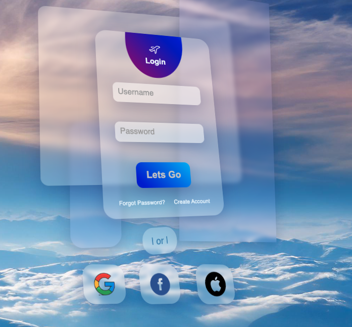

# Cool Logins CSS/JS Forms

This repository contains a collection of cool login CSS/JS forms created by @buggysoulLarry. Each form is designed to be visually appealing and unique.

## Login Form: Glass Sky

The first login form in this collection is called "Sky Glass Pane". It features a glass login form with floating glass panes in the background, creating a mesmerizing effect.

### Preview

### Usage

To use the "Glass Sky" login form, follow these steps:

1. Clone this repository: `git clone https://github.com/buggysoullarry/login_forms`
2. Open the `index.html` file in your web browser.
3. Enjoy the stunning visual experience and use the login form as needed.

## Contributing

If you have any cool login CSS/JS forms that you would like to contribute to this repository, feel free to submit a pull request. Please ensure that your forms are visually appealing and unique.

## License

This repository is licensed under the [MIT License](LICENSE).

## Contact

For any inquiries or collaborations, you can reach out to @buggysoulLarry on Instagram.

Happy coding!
